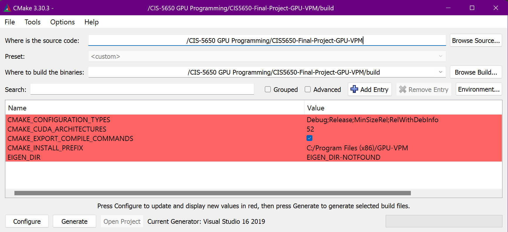
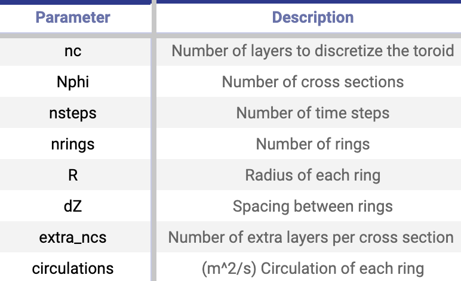
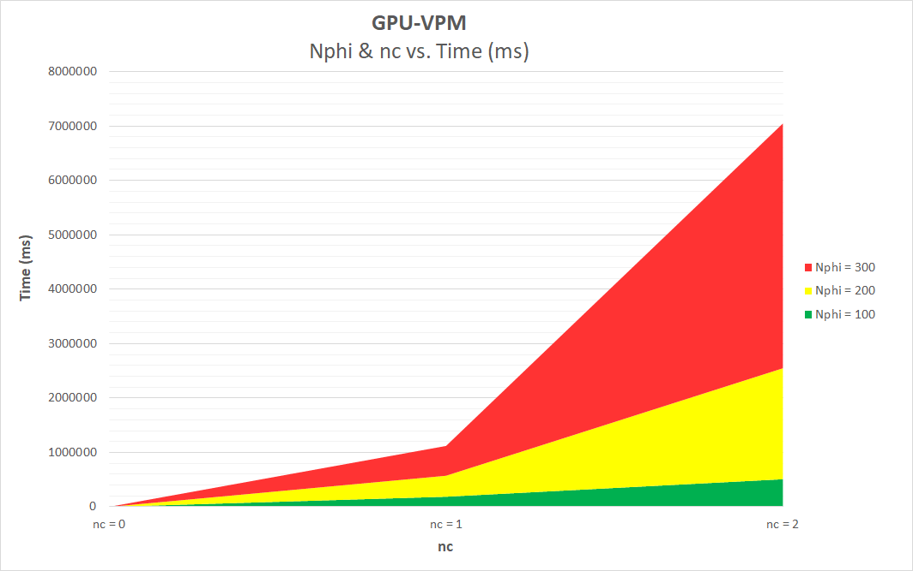
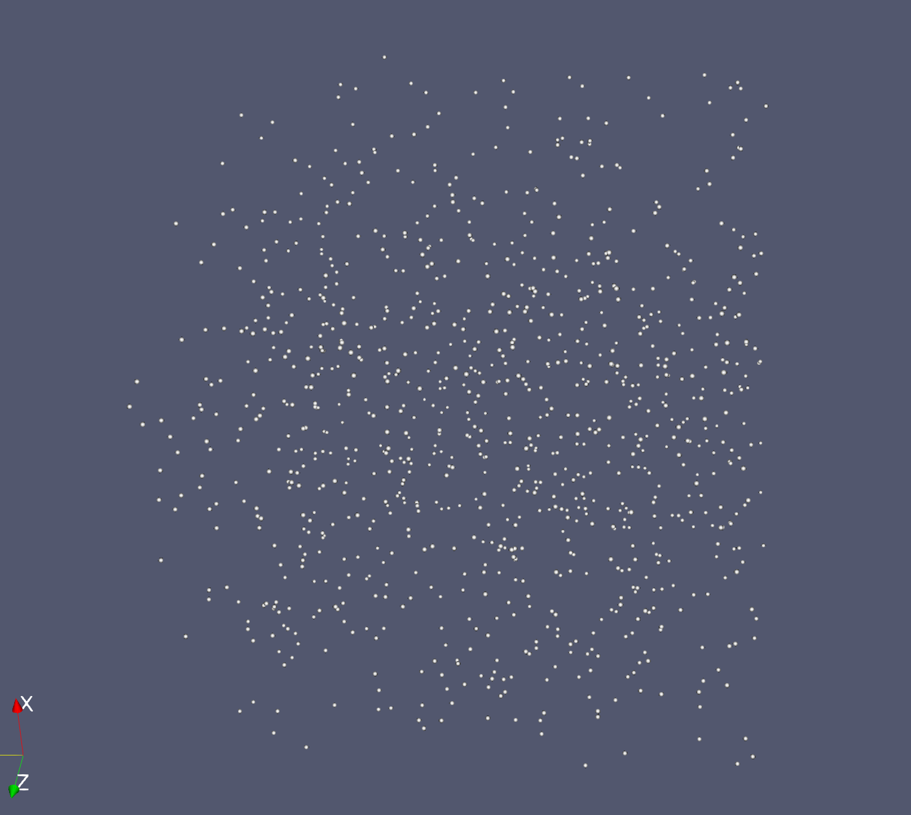

<h1 align="center"> GPU-VPM </h1>

✈  A GPU-based aerodynamics solver  ✈

## Description
GPU-VPM is a GPU-based implementation of the reformulated Vortex Particle Method (VPM) which simulates airflow in aerodynamics. 

Positioned between low-fidelity, fast simulations and high-fidelity, resource-intensive CFD methods, the Vortex Particle Method is a medium-fidelity approach which enables realistic aerodynamic modeling without requiring heavy computational resources.

GPU-VPM is implemented with CUDA, a parallel computing platform and API created by NVIDIA which allows software to use the GPU for faster processing. Thus, our implementation focuses on high-performance, parallelized vortex particle calculations which make it suitable for early-stage design of aerial vehicles.

## Build Instructions
1. Clone this repository to your computer.
2. Build the project using CMake. We recommend using CMake version 3.30.3.

    

3. Open the project using Visual Studio. We recommend **Visual Studio 2019**. 
4. Set the build mode to "Release" to run the project optimally.

    
5. Basic parameters, such as the max number of particles created in the simulation, can be set in the runSimulation() function found in kernel.cu:
    
    
    

## Methodology

We implemented the classic and the reformulated versions of VPM in CUDA that update the `ParticleField` object with each time step. The calculations for the particle parameters such as position, velocity, circulation are performed through Runge-Kutta time-integration method and the PedrizzettiRelaxation scheme.

We simulated two identical vortex rings with initial radii R = 1, thickness = 0.1, and separation dZ = 0.79. A **Vortex Ring** is essentially a doughnut-shaped region of fluid where the fluid particles spin rapidly around an imaginary circular axis. The discretization hierarchy went from a torus to cross sections into layers of rings, which in turn was discretized into cells around the circumference. The initialization parameters were chosen such that the number of particles do not exceed the maximum particles at any point of time.

## Implementation
We decided to implement this as a CUDA C++ project.
The VPM solver (which is used to simulate dynamic particles) runs on the GPU. We chose to implement a vortex ring as our primary simulation, with the following parameters for customization:

## Performance Analysis
Validation was performed via a comparison of the runtime of the vortex ring simulation using our GPU-based implementation versus the original CPU-based FLOWVPM implementation.

Our GPU based implementation was run on a laptop with the following specs:
* **MACHINE 1:** ASUS ROG Zephyrus M16
    * **OS:** Windows 11 
    * **Processor:** 12th Gen Intel(R) Core(TM) i9-12900H, 2500 Mhz, 14 Core(s), 20 Logical Processor(s)     
    * **GPU:** NVIDIA GeForce RTX 3070 Ti 

The original, CPU-based FLOWVPM implementation was run on a desktop PC with the following specs:
* **MACHINE 2:** CETS lab computer
    * **OS:** Windows 10
    * **Processor:** Intel(R) Xeon(R) CPU E5-1630 v4 @ 3.70GHz, 32GB
    * **GPU:** NVIDIA GeForce RTX 3070 Ti

Multiple machines were needed in order to ensure that data could be collected from the simulations in a timely fashion. 

## GPU-VPM Vortex Ring Simulation Performance
The following graph shows the performance of the vortex ring simulation using our GPU-based implementation. The simulation was run with the following constant parameters:

+--------------+----------------------+
| Parameter    | Value                |
+==============+======================+
| maxParticles | 2147483647 (INT_MAX) |
+--------------+----------------------+
| numTimeSteps | 2000                 |
+--------------+----------------------+
| blockSize    | 128                  |
+--------------+----------------------+

The values of Nphi and nc were increased incrementally as follows:
+------+----+
| Nphi | nc |
+======+====+
| 100  | 1  |
+------+----+
| 100  | 2  |
+------+----+
| 100  | 3  |
+------+----+
| 200  | 1  |
+------+----+
| 200  | 2  |
+------+----+
| 200  | 3  |
+------+----+
| 300  | 1  |
+------+----+
| 300  | 2  |
+------+----+
| 300  | 3  |
+------+----+

<i>Note: The max number of particles was set to INT_MAX for this simulation, but this was exceeded when the simulation ran with Nphi = 300 and nc = 3. Thus, this graph only includes up to nc = 2.
</i>

## Bloopers

<i>Randomly initialized points in a particle field. Our first sign of success! :)
</i>

<h2> 
Meet the Team
</h2>

+-----------------------------------------------------+--------------------------------------------------+-----------------------------------------------------------+
|             |           |                   |
+=====================================================+==================================================+===========================================================+
| Dominik Kau                                         | Nadine Adnane                                    | Shreyas Singh                                             |
+-----------------------------------------------------+--------------------------------------------------+-----------------------------------------------------------+
| [dominikk@seas.upenn.edu](dominikk@seas.upenn.edu)  | [nadnane@seas.upenn.edu](nadnane@seas.upenn.edu) | [shreyas4@seas.upenn.edu](shreyas4@seas.upenn.edu)        |
+-----------------------------------------------------+--------------------------------------------------+-----------------------------------------------------------+
| [LinkedIn](https://www.linkedin.com/in/dominikkau/) | [LinkedIn](https://www.linkedin.com/in/nadnane/) | [LinkedIn](https://www.linkedin.com/in/shreyassinghiitr/) |
+-----------------------------------------------------+--------------------------------------------------+-----------------------------------------------------------+

<h2 align="center">
Special Thanks
</h2>

<i> Special thanks to Ed Alvarez, without whom this project would not exist! :) </i>

## References
* [FLOWUnsteady](https://github.com/byuflowlab/FLOWUnsteady) (GitHub Repository of CPU implementation)
* [VTK Output](https://github.com/mmorse1217/lean-vtk)
* [FLOWVLM (Vortex Lattice Method)](https://github.com/byuflowlab/FLOWVLM)
* [Stable Vortex Particle Method Formulation for Meshless Large-Eddy Simulation](https://www.nas.nasa.gov/assets/nas/pdf/ams/2022/AMS_20220809_Alvarez.pdf) (Alvarez & Ning, 2023, research paper on reformulated Vortex Particle Method) 
* [NASA presentation slides for introductory concepts ](https://www.nas.nasa.gov/assets/nas/pdf/ams/2022/AMS_20220809_Alvarez.pdf)
* [Reformulated Vortex Particle Method and Meshless Large Eddy Simulation of Multirotor Aircraft](https://scholarsarchive.byu.edu/etd/9589/?utm_source=scholarsarchive.byu.edu%2Fetd%2F9589&utm_medium=PDF&utm_campaign=PDFCoverPages) (Alvarez PhD thesis on reformulated VPM) 
* [Scalable Fast Multipole Accelerated Vortex Methods](https://doi.org/10.1109/IPDPSW.2014.110) (Parallelized VPM) 
[Treecode and fast multipole method for N-body simulation with CUDA](https://arxiv.org/abs/1010.1482) (FMM implementation in CUDA)

  

University of Pennsylvania, CIS 5650: GPU Programming and Architecture, Final Project 

